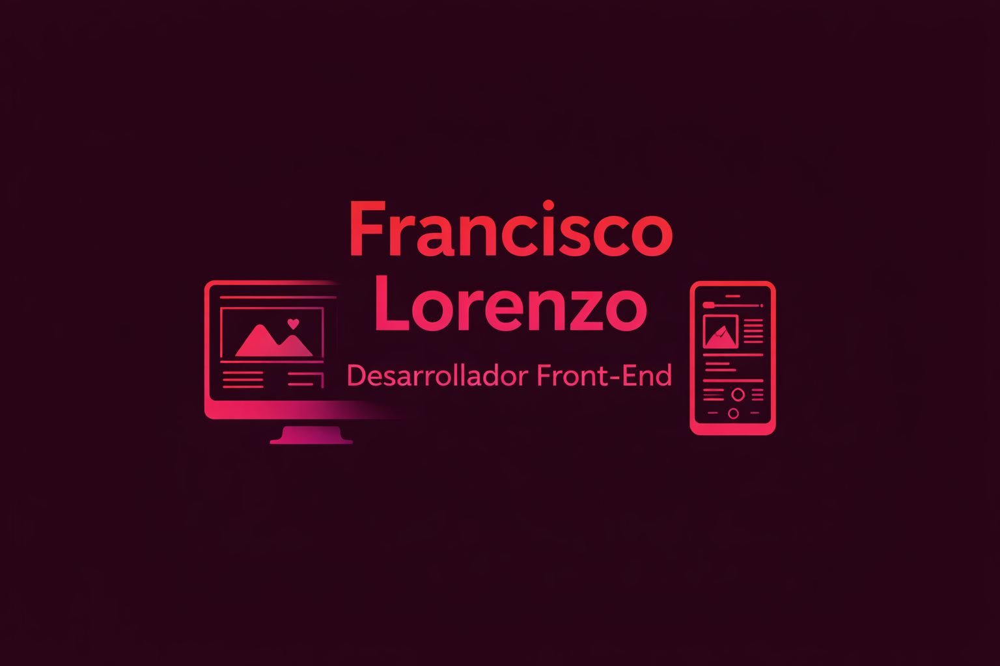

<div align="center">

# > FRANCISCO_LORENZO.PORTFOLIO

### Front-End Developer | React Developer

Portfolio personal desarrollado para presentar mis proyectos, habilidades técnicas y experiencia como desarrollador web.

[Demo Online](https://francisco-lorenzo.vercel.app/) • [LinkedIn](https://www.linkedin.com/in/franciscolorenzoo/) • [GitHub](https://github.com/franlorenzo1)

</div>

---

## $ whoami

Soy Francisco Lorenzo, egresado de la Tecnicatura Universitaria en Programación (UTN FRM) y desarrollador Front-End.

Este portfolio fue creado con el objetivo de centralizar mis proyectos, tecnologías y medios de contacto .

---

## $ stack --list

```bash
Frontend:
├── React
├── JavaScript
├── Tailwind CSS
├── Material UI
└── React Router

Herramientas:
├── Git
├── GitHub
├── Vercel
└── VS Code
```

---

## $ features

- Diseño responsive
- Estética inspirada en terminal Linux
- Animaciones suaves
- Sección de habilidades técnicas
- Sección de habilidades blandas
- Descarga directa de CV
- Integración con LinkedIn, GitHub y WhatsApp
- Deploy automático con Vercel

---

## $ tree src/

```bash
src
├── components
│   ├── About.jsx
│   ├── Footer.jsx
│   ├── Hero.jsx
│   ├── Navbar.jsx
│   ├── Projects.jsx
│   └── Skills.jsx
├── App.jsx
└── main.jsx
```

---

## $ run-project

### Clonar repositorio

```bash
git clone https://github.com/franlorenzo1/Francisco-Lorenzo.git
```

### Instalar dependencias

```bash
npm install
```

### Ejecutar entorno de desarrollo

```bash
npm run dev
```

### Generar build de producción

```bash
npm run build
```

---

## $ screenshot



---


## $ contact

📧 **Email:** franciscopacolorenzo@gmail.com

💼 **LinkedIn:**  
https://www.linkedin.com/in/franciscolorenzoo/

🐙 **GitHub:**  
https://github.com/franlorenzo1

📱 **WhatsApp:**  
https://wa.me/542613891594

---

<div align="center">

```bash
> status

Portfolio online ✔
Disponible para oportunidades laborales ✔
Aprendiendo constantemente ✔
```

</div>